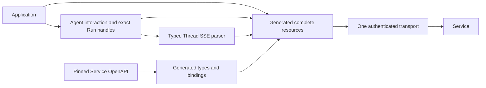

# TypeScript SDK Overview

`@converge.ai/a13n` has two layers and one wire implementation. The authored Agent-oriented layer supplies finite `Interaction` with iteration, authoritative result and Thread/receipt together. The complete generated `client.resources` layer maps each pinned schema operation to one typed HTTP call. Both use the same transport, authentication, error handling and generated route bindings; no parallel HTTP facade, workspace-scoped business tree, or client-side Agent executor exists.

The ordinary journey binds an Agent by **ID**, calls `start(input,{idempotencyKey,...})`, optionally iterates its finite output, reads `interaction.result()`, then calls `send(threadId,input,{idempotencyKey,...})` to continue. A Thread is not owned by any single Agent. The interaction retains the original `Submitted` receipt with Thread, Entry and nullable initial Run. Its result waits for Entry **consumption**, then observes only the incorporating Run; assignment alone is not incorporation. It stops at completed, failed, cancelled or waiting without following a successor. `RunOutcome.snapshot` and Run Items are authoritative; transient stream frames are not.

Business requests with API-key auth use the key's implicit workspace. Same-origin session callers select a workspace explicitly for declared workspace-scoped operations and use CSRF for protected mutations. Administration retains its explicit organization/workspace paths. Service alone owns identities, authorization, durable state, versioning and retention. Wire fields remain snake_case and preserve omission versus explicit null; authored options use camelCase. The package imports neither Service runtime nor another SDK.
