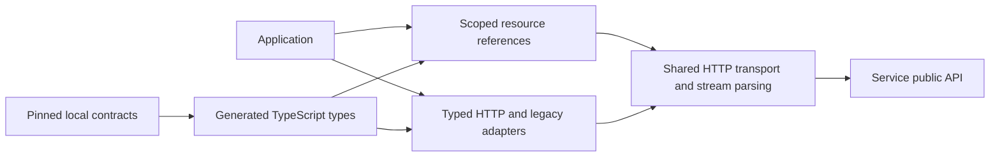

# TypeScript SDK Overview

## Architecture and boundaries

The SDK combines a complete typed HTTP surface with explicitly scoped resource conveniences on one client. Public requests are Promise-based. Resources use local `collection.ref(...)` factories, observation uses pull-based asynchronous iteration, and cancellation uses `AbortSignal`. The SDK is neither a workflow runtime nor a mutable active-record model.

Service alone authorizes and commits durable effects. The SDK preserves request scope, preconditions, receipts and error evidence. Its local references, iterators and shutdown do not acquire execution authority. No Service source, Console client or sibling SDK is a runtime or generation dependency.

## Managed-Agent flow

1. `createClient(...)` selects explicit authentication and shared transport lifetime.
2. `client.workspaces.ref(workspaceId).agents.ref(selector)` binds local references without I/O.
3. `agent.start(input, options)` resolves a key if needed and submits an explicit idempotent command. The accepted receipt supplies actual Session, Thread and Run identities.
4. `accepted.run.stream(options)` constructs a lazy observation. The first pull opens the attachment; the application applies each observation before asking for the next.
5. Commands use the exact Run or Thread reference. Queueing and successor acceptance retain their distinct identities; no helper silently follows successors.
6. `run.wait(...)` reads sealed Run state within an explicit deadline. The application interprets output and pending actions. Stream exhaustion is not business success.
7. Local stream/client cleanup ends observation and owned transport work, not durable Service execution.

The detailed owners are [resources/lifetime](01-resources-and-client-lifetime.md), [interaction/control](02-interaction-and-control.md), and [observation/data access](03-observation-and-data-access.md).

## Stable design boundaries

- References are scoped identities and commands; reads return fresh representations with response evidence.
- SDK method/options names are camelCase; generated wire bodies retain snake_case, omission and explicit null.
- Preconditions and idempotency keys are caller-supplied. Mutation acknowledgements can be lost without rollback; mutations are not automatically replayed.
- Collection capabilities follow exported operations rather than universal CRUD. [Management](04-resource-management.md) owns pagination and streaming binary access.
- Run sealing, stream exhaustion, Item completeness and Item finalization are independent facts.
- The resource facade is additive. Existing raw HTTP, raw stream and notification contracts remain explicit under [compatibility](05-protocol-and-compatibility.md).
