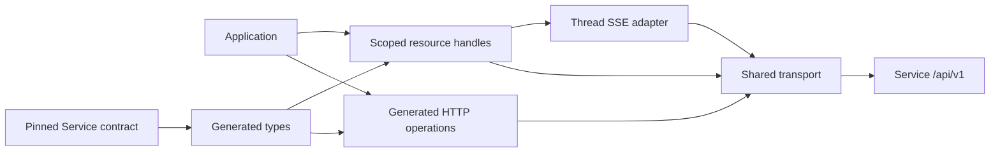

# TypeScript SDK Overview

The package exposes one complete generated resource tree at `client.resources`. Each operation has one generated route binding. Run `wait` calls that handle's generated `get`; Thread `events` decodes its generated `stream.get` response. `textPayload` is a pure message builder, not a second submission API. All handles bind locally; no construction fetches remote state.

`client.http` is the explicit low-level escape hatch for custom headers, middleware and response parsing through generated OpenAPI paths. It shares authentication and shutdown with resources, but does not add a second managed graph or workspace wrapper. The SDK does not authorize or execute agents itself.

The normal path is: choose a workspace, submit a `NewThread` with an Agent ID and idempotency key, retain the `Submitted` receipt including its inbox entry and nullable Run, read the Run's committed Items, and optionally observe live Thread events. Further messages go to that Thread's inbox; a submitted entry can start immediately or wait while another Run occupies the Thread. Resume, interrupt and fork target exact Run identities. Streaming is observation only: a frame, EOF or local close neither commits execution nor proves business success. Service responses are the source of truth.

Generated wire fields retain snake_case and omission versus explicit null; SDK options use camelCase. Service alone owns authorization, state, versioning and retention. This package never imports Service runtime or another SDK.
