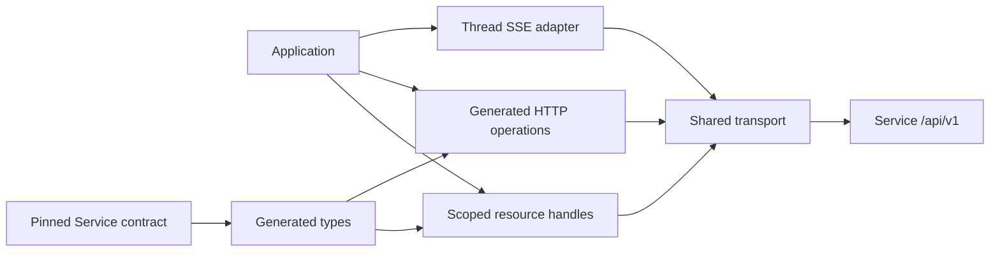

# TypeScript SDK Overview

The package exposes a complete generated `client.http` surface and `client.workspaceHttp(workspaceId)` for explicitly bound workspace routes. Selected managed resource handles add local `ref(id)` construction, pagination, submission and Run waits. They share one authenticated transport; no handle fetches until a method is called. The SDK does not authorize or execute agents itself.

The normal path is: choose a workspace, submit a `NewThread` with an Agent ID and idempotency key, retain the `Submitted` receipt including its inbox entry and nullable Run, read the Run's committed Items, and optionally observe live Thread events. Further messages go to that Thread's inbox; a submitted entry can start immediately or wait while another Run occupies the Thread. Resume, interrupt and fork target exact Run identities. Streaming is observation only: a frame, EOF or local close neither commits execution nor proves business success. Service responses are the source of truth.

Generated wire fields retain snake_case and omission versus explicit null; SDK options use camelCase. Service alone owns authorization, state, versioning and retention. This package never imports Service runtime or another SDK.
