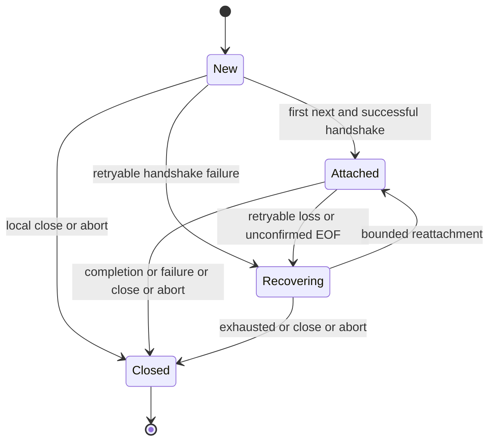

# Observation and Data Access

This contract owns the resource RunStream lifetime, applied cursors, recovery and retained Item reconciliation. [Run commands](02-interaction-and-control.md) own remote effects; closing an observation does not exercise that authority. [Compatibility](05-protocol-and-compatibility.md) separately preserves the legacy raw stream.

Use a concrete lazy `AsyncIterableIterator<RunEvent>`, not an async context manager, EventEmitter, Observable, or eagerly connected async generator. The existing `RunEvent` envelope remains `{ cursor, event }`; cursor and event ID remain distinct.

```typescript
interface ObserveRunOptions {
  after?: string;
  signal?: AbortSignal;
  reconnect?: boolean;
  maxReconnects?: number;
}

interface RunStream extends AsyncIterableIterator<RunEvent> {
  readonly run: Run;
  readonly closed: boolean;
  readonly response: StreamResponse | undefined;
  readonly lastReceivedCursor: string | undefined;
  next(): Promise<IteratorResult<RunEvent, void>>;
  return(): Promise<IteratorResult<RunEvent, void>>;
  close(): Promise<void>;
  [Symbol.asyncIterator](): RunStream;
}

interface StreamResponse {
  readonly status: number;
  readonly headers: Headers;
}
```

`run.stream(options?)` is synchronous and I/O-free. First `next()` attaches. `for await...of` is the normal consumer. The stream is single-use and single-reader; repeated calls to `[Symbol.asyncIterator]()` return the same object, not independent broadcasts. Concurrent `next()` rejects before acknowledging the prior observation and does not cancel the legitimate pending read. The stream has no `then`, implicit result, output accumulator, or separate `events()` iterator.

`response` holds a detached copy of the latest successful handshake metadata, initially undefined. Previously returned metadata is not replaced in place; its Headers copy is not a live view of internal state. It exposes no SSE body. `lastReceivedCursor` advances on yielded observations only and is explicitly diagnostic, not a saved checkpoint.



## Local cleanup versus remote commands

- `close()` is idempotent, cancels an active reader or backoff immediately and resolves after owned local cleanup. It does not wait for another SSE event. A pending `next()` resolves with `done: true` on explicit local close.
- `return()` calls the same local close path and resolves done. Early `for await...of` break or consumer-body failure therefore releases the attachment. A concrete implementation must not merely enqueue generator return behind a blocked network read.
- An external signal abort or client shutdown instead rejects the pending read with its abort reason. Terminal stream failure rejects the active read; subsequent reads are exhausted. Closure never acknowledges an unprocessed event.
- Before first read, close sends no request. After closure the object cannot reopen; create a new stream explicitly.
- SDK-owned cleanup must not replace a consumer exception. A custom fetch implementation that ignores abort cannot be claimed force-terminable by the SDK.
- `client.close(): void` remains the existing synchronous signal of final local shutdown; it is not a new promise that all custom providers have settled. It prevents new owned dispatches, aborts owned work and initiates attachment cleanup. `await stream.close()` is the explicit stream cleanup boundary.
- Registered Bearer callbacks are application-owned promises. Shutdown or caller abort while awaiting one must prevent later request dispatch when that callback resolves; it does not forcibly terminate callback code.

Remote commands stay on `Run`. Use `stream.run.steer(...)`, `stream.run.cancel(...)`, or the original `run` from another asynchronous task. Do not add redundant stream-level command aliases. Stream-local abort does not cancel an independently issued command unless the application deliberately supplied the same signal to both. Closing the entire client can abort both, with unknown-outcome semantics for a mutation already dispatched.

A successful `run.cancel(...)` does not call `stream.close()`; retained events may still be read. Waiting and SSE reading remain independent. No lock on the stream's reader serializes unrelated HTTP commands.

## Applied cursor and bounded recovery

The initial resume cursor is `after`, meaning the last completely applied entry. Delivering, parsing or prefetching an event does not advance it. Requesting the next observation acknowledges the previously yielded cursor in memory; the application must finish applying the event before that request. Heartbeats and closure do not acknowledge anything.

This supports a sequential `for await` body with an awaited apply/checkpoint operation. Sending work to a background task and requesting the next event immediately does not prove that work completed. Such applications must coordinate their own processing or disable automatic reconnect and reattach with their own applied cursor. There is no durable SDK checkpoint, exactly-once guarantee, or JSON serialization of a live stream.

The resource stream uses this recovery policy:

| Concern            | Rule                                                                                                                                                                     |
| ------------------ | ------------------------------------------------------------------------------------------------------------------------------------------------------------------------ |
| Defaults           | `reconnect: true`, `maxReconnects: 5`; non-negative integer, zero disables recovery.                                                                                     |
| Retryable failures | Transient connection/read loss; handshake 429, 502, 503, 504; unconfirmed clean EOF.                                                                                     |
| Non-retryable      | Caller abort, client close, authentication/permission errors, malformed/incompatible events, invalid cursor, replay gap, local argument or lifecycle errors.             |
| Budget             | At most `maxReconnects` additional attachment attempts per no-progress recovery episode, including initial handshake failures.                                           |
| Reset              | Only next-read acknowledgement of a newly delivered cursor; not a successful handshake, heartbeat, or empty EOF.                                                         |
| Delay              | Before retry n: jitter in `[base/2, base]`, `base = min(500 * 2^(n-1), 10000)` ms. Valid Retry-After seconds/date supplies a lower bound capped at 30000 ms.             |
| Ownership          | This policy alone counts SSE attachment attempts; generic GET retries cannot multiply it. Completion-evidence reads are single-attempt within the same recovery episode. |
| Resource           | Every attachment targets the same Run and explicit Workspace context, exclusively after the applied cursor. Release the old response before opening another.             |
| Exhaustion         | Reject with the last API/transport failure; unconfirmed EOF exhaustion is a transport failure, not success.                                                              |

A valid stream event must match the requested Run, pinned envelope version and framing rules. Check resource identities and fields needed by the SDK, but do not advertise full runtime validation of arbitrary event payloads. Do not fabricate a closed discriminated union of event-specific payloads from a schema declaring an open payload object. Buffering is bounded; oversized or truncated frames fail explicitly.

## Gaps and EOF

HTTP `409 run_stream_replay_gap` and the exact terminal `a13n.service.replay_gap` frame raise `ReplayGapError`. The terminal gap has no advancing event ID and is not yielded as a domain observation. Preserve `run_id`, `requested_cursor`, `retained_floor`, and `high_watermark` from actual wire evidence when available. Do not require absent fields or substitute a convenience name such as `available_floor` for the wire field.

Gap recovery is explicit: read current Run, pending actions and retained Items, replace only the covered display projection, then attach after its projection cursor if not finalized. No silent cursor reset, snapshot substitution, or claim of exact missing-event replay.

A clean EOF with recovery disabled exhausts observation without declaring the Run complete. With recovery enabled:

1. A matching Service terminal event (`run.completed`, `run.failed`, `run.cancelled`, `run.waiting`) is yielded, then the current attachment is drained through clean EOF before normal exhaustion. A read failure before EOF remains recoverable; AG-UI finish or an Attempt event is not a substitute.
2. Otherwise, one exact Run read and one Run Item-page metadata read can establish that the Run is sealed and its finalized projection cursor equals the acknowledged cursor. Only then may an empty resumed attachment exhaust normally. These reads neither advance the cursor nor replace the application's display.
3. A newer/incomplete/unavailable projection, absent cursor evidence, or an unsealed Run does not prove all observations were consumed. Continue bounded recovery or surface the actual API/gap failure. Never poll forever after the budget is exhausted.

Stream completion, Run sealing, Item completeness and Item finalization are separate facts.

## Retained Items

Item reconciliation uses full Item pages, preserving `snapshot_version`, `projection_cursor`, `complete`, `finalized` and `incomplete_reason`. A UI can replace a display projection only after loading the consistent snapshot's required pages. Do not flatten away page metadata or invent `items.ref(id).get()` if only a collection route exists.
